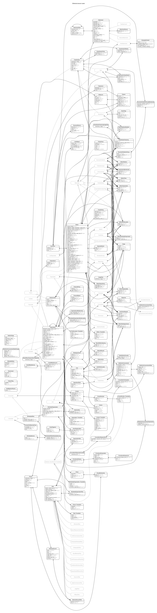
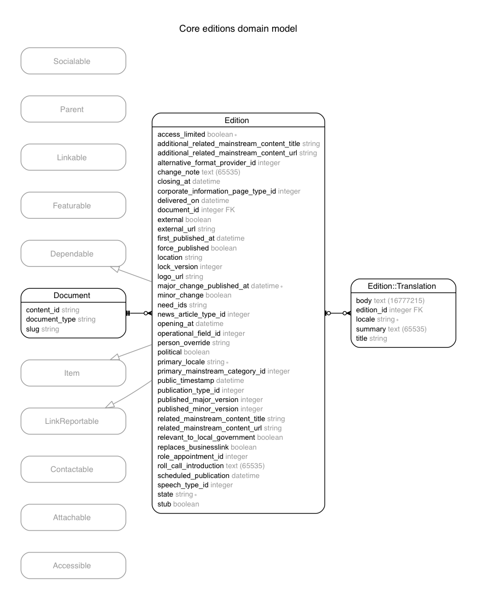
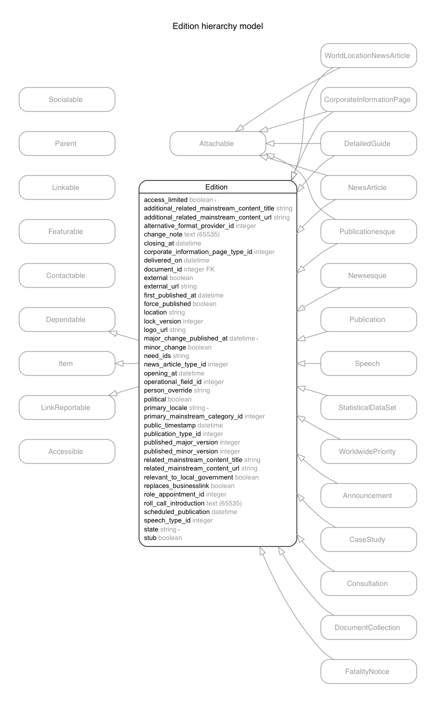

# Overview

Whitehall is a big ungainly application which has grown organically in the
manner of a mushroom or other fungus, often under intense time pressure.

We're breaking it apart over time, but for now it has many responsibilities.

Whitehall is all about documents, and the editions of documents.
And people, and their roles.
And organisations.  And contact info.  Also groups of people, and countries.
And emails, and Atom feeds.

Here's the domain model:

This serves only to demonstrate that a) it's chaos and b)
pretty much everything attaches to editions or organisations.

## Documents

Each document has a single entry in the `documents` table, and one or more edition
in the `editions` table.  Editions represent the current and historical content
of the document, including current state.

Although you would expect most things to deal with [Document](/app/models/document.rb)
objects, the system primarily deals with [Edition](/app/models/edition.rb)s and
the subclasses thereof.  This is less than ideal but it's what we've got.

The `edition_translations` table holds the main content of a document, that is
the body, summary, and title.  These three models are the ones you will most
commonly be looking at.

## Edition hierarchy

Editions are heavily subclassed.

Bear in mind that this only shows inheritance as pertains to database tables;
The relationship for [Publication](/app/models/publication.rb) actually travels
via [Publicationesque](/app/models/publicationesque.rb) in the Ruby hierarchy.
